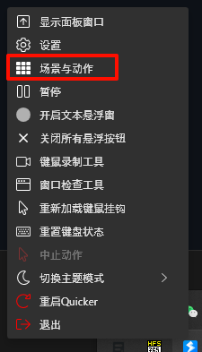

# Quicker Actions

[English](./README.md) | [简体中文](docs/README_ZH.md)

This repository contains Quicker actions that implement various automation tasks.

Currently, the main focus is on generating backlinks, such as generating backlinks for video frames and corresponding timestamps, PowerPoint slides and corresponding page numbers, and PDF pages and corresponding positions.

## Usage

1. Install Quicker software.
2. Import the actions:
   1. Right-click on the Quicker icon and click on "场景与动作" (Scenes and Actions). 
   2. Right-click on the Actions page and click on "导入动作" (Import Actions). 
   3. Select the JSON file.
3. Set shortcuts or gestures for the actions.
4. Press the corresponding shortcut in the respective software.
5. Afterwards, it may involve pasting or automatically adding the generated content in your note-taking software.

### Video annotation

#### Actions
[add image and link by json.json](actions/视频摘录/add%20image%20and%20link%20by%20json.json)、[add image and link by url.json](actions/视频摘录/add%20image%20and%20link%20by%20url.json)

Or

[add image and link by url.json](https://getquicker.net/Sharedaction?code=674227a5-eede-4b6b-7e5a-08dc1f70b83a)、
[add image and link by json.json](https://getquicker.net/Sharedaction?code=9e0fe189-dcb2-4e9b-7e5b-08dc1f70b83a)

#### potplayer设置

如果你要自定义快捷键，需要把quicker动作中设置的快捷键一起改

### PPT annotation

#### Actions

[get current slide link.json](actions/PPT摘录/get%20current%20slide%20link.json)

## Feedback, questions, ideas, problems

Feel free to contact me if:

- You have any issues or questions regarding usage.
- You have suggestions or feedback.
- You want to discuss interesting ideas or new features.

Communication channels can be:

- GitHub issues.
- Email.
- Bilibili comments or private messages.
- My personal contact information (WeChat, QQ).

## Say Thank You

If you find the modifications I made helpful to you, feel free to leave comments and messages.

You can also sponsor me a cup of coffee:

- WeChat sponsorship code.

- ko-fi
  
