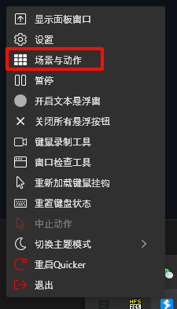
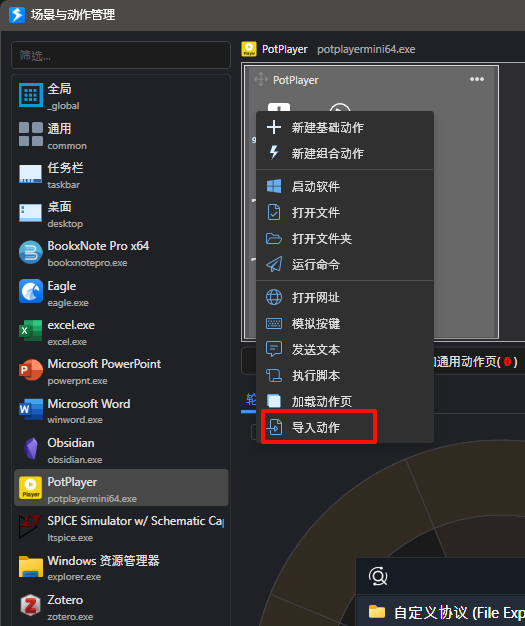

# Quicker Actions

[English](../README.md) | [简体中文](./README_ZH.md)

这个仓库是一些quicker动作，实现了一些自动化动作。

目前主要都是生成回链用的动作，如生成视频画面和对应时间戳的回链、PPT画面和对应页码的回链、PDF画面和对应位置的回链。

## 使用

1. 安装quicker软件
2. 导入动作
   1. 右键图标，点击场景与动作
   2. 在动作页右键，点击导入动作
   3. 选择json文件
3. 给动作设置快捷键或者轮盘
4. 在对应软件中按对应快捷键
5. 之后在笔记软件中可能是粘贴或自动添加

### 视频摘录

#### 动作
[add image and link by json.json](../actions/视频摘录/add%20image%20and%20link%20by%20json.json)、[add image and link by url.json](../actions/视频摘录/add%20image%20and%20link%20by%20url.json)

或者 [add image and link by url.json](https://getquicker.net/Sharedaction?code=674227a5-eede-4b6b-7e5a-08dc1f70b83a)、
[add image and link by json.json](https://getquicker.net/Sharedaction?code=9e0fe189-dcb2-4e9b-7e5b-08dc1f70b83a)

#### potplayer设置

如果你要自定义快捷键，需要把quicker动作中设置的快捷键一起改

### PPT摘录

- 动作：[get current slide link.json](../actions/PPT摘录/get%20current%20slide%20link.json)

## 问题、反馈、创意

欢迎联系我，如果：

- 遇到使用问题
- 建议与反馈
- 交流沟通有趣的想法、新的feature

沟通渠道可以是：

- github issue
- 邮件
- B站留言或私信
- 我的个人联系方式 (微信、qq)

## 赞助

如果你觉得我做的这些修改对你有所帮助，欢迎评论、留言。

你也可以赞助我一杯咖啡：

- 微信赞助码 
  
- ko-fi
  
